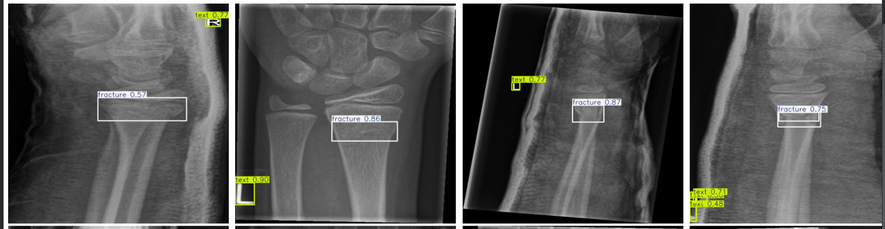
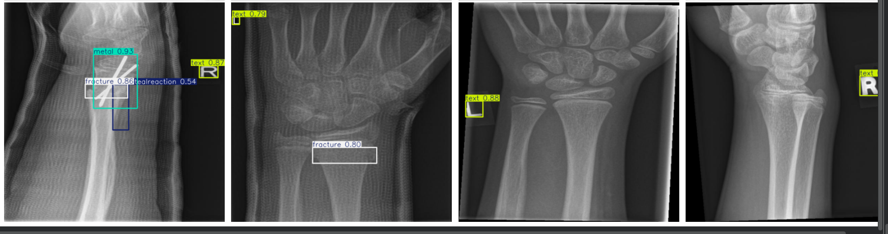

# Pediatric Wrist Fracture Detection with YOLOv8

Fine-tuning a YOLOv8 object detector to localize wrist fractures (and related radiographic findings) on pediatric trauma X-rays, evaluated with per-class metrics rather than a single accuracy score.

**Author:** Ali Nyirenda Jr — MBChB Candidate, University of Lusaka
[LinkedIn](https://linkedin.com/in/ali-nyirenda-a86159242) · [GitHub](https://github.com/alinyirenda)

---

## Motivation

Wrist fractures are among the most common pediatric trauma presentations. Radiograph interpretation is reliable but time-consuming and depends on specialist availability. This project explores whether a lightweight object detector can localize fractures directly on X-rays as a proof of concept for AI-assisted triage, not as a diagnostic tool, but as a demonstration of the underlying technique applied to a problem I understand clinically.

## Dataset

[GRAZPEDWRI-DX](https://doi.org/10.6084/m9.figshare.14825193) (Nagy et al., 2022, *Scientific Data*) — pediatric wrist trauma radiographs, radiologist-annotated with bounding boxes across 9 finding categories. This project used the YOLOv8-formatted subset hosted on [Roboflow Universe](https://universe.roboflow.com/project-bef88/grazpedwri-dx), licensed CC BY 4.0.

### How X-Rays Work

An X-ray image is a map of how much radiation passed through the body and reached the detector on the other side. Denser tissue absorbs more radiation and lets less through, so it appears white on the image (radiopaque). Less dense tissue absorbs less and lets more radiation through, so it appears darker (radiolucent). This is why metal implants show up bright white (very dense, almost nothing gets through), bone appears light gray, and soft tissue appears darker gray.

*More detail on the physics can be found in [x-ray-physics.md](docs/x-ray-physics.md), and more detail on the anatomy in [wrist-anatomy.md](docs/wrist-anatomy.md).*

### Relevant Anatomy

The wrist joint in this dataset is formed by the distal radius and ulna (the two forearm bones) meeting the proximal row of carpal bones. In children specifically, the ends of the radius and ulna each contain a growth plate (the physis), a region of active bone growth that hasn't yet fused into solid bone. This is clinically important because the growth plate is a common site of injury in pediatric fractures (the Salter-Harris injuries referenced in the fracture definition below), and its normal appearance on X-ray can be mistaken for a fracture line by an untrained reader. The sample X-rays in the gallery further down this README show these structures directly.

### What Do These Classes Mean?

- **Fracture** - A discontinuity of the bone with associated soft tissue injury. In this pediatric population, this predominantly means distal radius/ulna fractures (buckle/torus, greenstick, and Salter-Harris physeal injuries being the classic patterns for this age group). The dataset does not specify fracture subtypes; therefore, the model is learning "fracture present," not a classification of specific fracture types.

- **Text** - An annotation artifact (laterality markers, technologist initials, exposure indicators). Included as a negative-signal class so the model learns to disregard radiopaque overlay text rather than falsely identifying it as a clinical finding.

- **Metal** - Metallic objects appear radiopaque (white) on X-ray because the heavy concentration of electrons in metallic atoms completely absorb the X-ray photons, preventing them from reaching the underlying film or digital sensor. This leaves that section unexposed (white), in contrast to tissue that allows the passage of X-ray photons, resulting in exposure (grey, dark). This dataset contains hardware such as K-wires, plates, or incidental metal (jewelry, snap fasteners). These are clinically relevant since post-surgical or previously-treated wrists look different from acute presentations, which affects what "normal" looks like to the model. From the examples reviewed, several appear to be fixation wires (K-wires) rather than plates or incidental jewelry.

- **Periosteal Reaction** - Periosteal new bone formation. In children, the periosteum is loosely attached and reactive, so in the acute pediatric trauma context this finding most often reflects a subacute healing response and can appear within days of injury. That's different from the more sinister differential this finding can raise in isolation: **osteomyelitis** (infection, often with a laminated or "onion-skin" periosteal pattern and possible sequestrum), or a malignant bone tumor such as **Ewing sarcoma** (classically onion-skin or lamellated periosteal reaction) or **osteosarcoma** (classically a sunburst or Codman triangle pattern), though these are far more common at the distal femur/proximal tibia than the wrist. This context matters because the model has no way to distinguish a benign post-traumatic healing reaction from one of these more concerning patterns from imaging alone; it's just detecting that periosteal new bone is present, not classifying why.

- **Pronator Sign** - The pronator quadratus fat pad sign: displacement or obliteration of the normal fat stripe anterior to the distal radius/ulna on the lateral view. Radiologists and clinicians use this sign to help identify occult distal radius fractures. These are cases where the fracture line itself isn't clearly visible, but soft tissue swelling displaces the adjacent fat pad, giving an indirect clue that trauma has occurred.

- **Soft Tissue** - Regional soft tissue swelling, a nonspecific trauma marker. This has a lower specificity than the pronator sign, since swelling can reflect a broader differential such as a sprain, contusion, or hematoma, not fracture specifically but still a relevant secondary cue.

- **Bone Anomaly** - Normal developmental variants (accessory ossification centers, e.g. os styloideum, or other non-pathologic structural variation) rather than acute pathology. Clinically this category exists mainly to prevent the model (and reader) from misinterpreting a variant as an acute finding.

- **Bone Lesion** - Focal intraosseous lesions (most commonly in this age group: unicameral/simple bone cysts, or other benign lytic lesions incidentally captured on trauma imaging), distinct from fracture, and clinically important as an incidental finding that may warrant follow-up regardless of the trauma presentation.

**Class Balance** (training examples per class):

| Class | Training examples |
|---|---|
| text | 1,947 |
| fracture | 1,455 |
| periostealreaction | 279 |
| metal | 68 |
| pronatorsign | 48 |
| softtissue | 33 |
| boneanomaly | 23 |
| bonelesion | 2 |

`fracture` and `text` dominate the dataset, while `boneanomaly` and `bonelesion` are extremely rare. This imbalance is directly reflected in per-class results below.

## Method

- **Model:** YOLOv8n (nano), initialized from COCO-pretrained weights and fine-tuned (not trained from scratch).
- **Training:** 1,675 training images, 640×640 image size, batch size 16, early stopping with patience 15. This run completed the full 60 epochs without early stopping triggering. An earlier run on identical data and code stopped at epoch 59 with best weights from epoch 44, a reminder that training outcomes for this setup vary somewhat run to run.
- **Hardware:** free-tier Google Colab T4 GPU. Full training run: under 30 minutes.
- **Inference speed:** once trained, the model processes a single X-ray in roughly 2 to 5 milliseconds on this same free GPU, meaning several hundred images could be screened per second. Runtime is not the bottleneck for this approach. The accuracy limitations discussed below are the actual constraint on clinical usefulness, not speed.
- **Data integrity check:** confirmed **zero patient overlap** between train and test splits (1,247 vs. 221 unique patients), so test performance is not inflated by the model having seen the same patient's wrist from a different projection or angle.

## Results

### A Few Terms Used Below

- **mAP (mean Average Precision)** - the standard object detection score. It measures how well predicted boxes match the true boxes across all classes. Higher is better, maximum is 1.0.
- **mAP@50 vs mAP@50-95** - mAP@50 counts a prediction as correct if its box overlaps the true box by at least 50%. mAP@50-95 is stricter, averaging that same check across overlap thresholds from 50% to 95%, so it rewards more precisely placed boxes.
- **Precision** - of everything the model flagged as a given class, the percentage that was actually correct.
- **Recall** - of everything that was actually present, the percentage the model successfully found.
- **Confidence score** - how sure the model is about a given prediction, shown as a number between 0 and 1 on each detection box.

**Overall:** mAP@50 = 0.477, mAP@50-95 = 0.279 (across all 8 classes)

**Per-Class:**

| Class | Test instances | Precision | Recall | AP50 |
|---|---|---|---|---|
| fracture | 422 | 0.85 | 0.83 | **0.880** |
| text | 570 | 0.97 | 0.98 | 0.982 |
| metal | 16 | 0.93 | 0.88 | 0.875 |
| periostealreaction | 81 | 0.53 | 0.47 | 0.457 |
| pronatorsign | 10 | 0.72 | 0.30 | 0.464 |
| softtissue | 14 | 0.39 | 0.07 | 0.155 |
| boneanomaly | 5 | 0.00 | 0.00 | 0.001 |
| bonelesion | 1 | 0.00 | 0.00 | 0.000 |

**Clinical Interpretation:**

- Recall corresponds to sensitivity, the proportion of true fractures the model catches. Precision corresponds to positive predictive value, the proportion of flagged fractures that are real. A missed fracture costs more clinically than a false positive, so a triage tool should be tuned toward recall. This baseline isn't yet: a recall of 0.83 means roughly 1 in 6 true fractures were missed at this confidence threshold, therefore this tool is far from clinically applicable in its current form.
- `boneanomaly` and `bonelesion` failed almost completely this run, scoring near zero on both precision and recall. With only 5 and 1 test instances respectively, this isn't a meaningful measurement of model capability so much as a demonstration that a class needs a minimum volume of data before its metrics mean anything at all.
- The two indirect signs radiologists rely on to catch subtle or occult injuries showed a mixed picture. `periostealreaction` recall improved to 0.47 (AP50 0.457) compared to an earlier run, while `pronatorsign` recall dropped to 0.30 (AP50 0.464) compared to a stronger result previously. With only 10 test instances for pronator sign, this swing across runs likely reflects small-sample noise rather than a real change in what the model learned.
- `metal` reached strong precision (0.93) and recall (0.88) from only 68 training examples, likely because radiopaque hardware is visually distinct (bright, high-contrast, geometrically regular) and closer to the kinds of rigid objects the COCO-pretrained backbone already knew how to detect. This is a cleaner result than an earlier run on the same data, which had lower precision (0.64) despite similar recall, another sign that with only 16 test instances, this class's exact numbers should be read as directionally strong rather than precisely stable.
- `text` scored highest overall, but it's a visual marker (high-contrast printed letters), not a pathological finding, so it isn't the result this project is actually about. That said, it's worth acknowledging that correctly identifying these markers isn't clinically trivial. Laterality markers can be misplaced or overlooked, and confirming the correct side is a genuine patient safety concern, since a wrong-side error carries real consequences even though it's unrelated to fracture detection itself.

## Example Predictions



The model performed well on clear fracture cases, correctly localizing the fracture line with confidence scores in the 0.75 to 0.87 range across several test images, and in one case correctly identified three separate findings on the same wrist at once (metal at 0.93, fracture at 0.86, and periosteal reaction at 0.54), which is a reasonable result given how visually busy that particular image is with surgical hardware present.



One prediction is worth calling out as a limitation rather than a success. On one image the model flagged a fracture at only 0.57 confidence, the lowest score among the fracture detections reviewed. The box placement is plausible but the finding itself is subtle, consistent with the buckle or torus pattern discussed in the class glossary above, where cortical bulging without a clear fracture line can be genuinely difficult to distinguish even for a trained reader. A second issue worth noting separately is that the model sometimes produces overlapping duplicate detections for the same text marker, seen in one image as three stacked boxes for a single laterality letter at confidences of 0.71, 0.50, and 0.48. This does not affect fracture performance directly but suggests the confidence threshold used during inference could be tightened, or non max suppression made stricter, to clean up redundant low value predictions.

## Limitations

- Trained on a public research dataset subset (not the full 20,327-image GRAZPEDWRI-DX release).
- Pediatric wrist X-rays only, does not generalize to adult anatomy or other body regions.
- Rare-class performance (`boneanomaly`, `bonelesion`, `softtissue`) is unreliable due to limited training data, not a fundamental model failure.
- Metrics on rare classes (`boneanomaly`, `bonelesion`, `pronatorsign`, `metal`) showed meaningful swings between two separate training runs on identical data and code, underscoring that these specific numbers are noisy estimates rather than stable measurements and shouldn't be over-interpreted.
- Not threshold-tuned for a triage-appropriate recall/precision tradeoff. The default confidence threshold used here was not optimized to minimize missed fractures, which is what a real triage tool would need to prioritize.
- **Not clinically validated.** This is a portfolio/learning project demonstrating applied object detection on a public benchmark. It is not a diagnostic tool and is not a substitute for radiologist review.

## Where This Kind of Tool Should Add Value

It's worth being explicit about what a model like this is actually good for, since the results above suggest a specific answer, and it isn't "reading the whole X-ray."

An obvious fracture with a clear cortical break is something a trained clinician catches quickly. The results here reflect that: `fracture` was already the model's strongest clinically relevant class before any tuning. Where a tool like this could genuinely help is the harder, easier-to-miss cases: the indirect signs (`pronatorsign`, `periostealreaction`) that this project's own results show are currently the weakest, and the subtle, non-displaced patterns (buckle fractures without a visible line) that are easy to overlook under time pressure. That's the opposite of where this baseline currently performs best, which is itself a useful finding, not just a limitation.

Any real version of this also has to be age-aware. As the anatomy documentation covers, normal carpal ossification varies enormously by age, and a model (or reader) that doesn't account for a patient's age risks flagging a completely normal developmental stage as an anomaly. A clinically useful tool would need patient age as an input, not just the image.

## Reproducing This Project

```bash
pip install ultralytics roboflow
```

1. Download the dataset from [Roboflow Universe](https://universe.roboflow.com/project-bef88/grazpedwri-dx) (YOLOv8 format).
2. Run `wrist_fracture_detection_yolov8.ipynb` top to bottom in Google Colab (GPU runtime).
3. Trained weights and evaluation plots save automatically to `runs/detect/`.

## What's Next

If this project continued past a single day, the priorities would be:

- **Threshold tuning for recall.** Since a missed fracture is clinically costlier than a false positive, lowering the confidence threshold specifically for the fracture class (rather than using one threshold across all 8 classes) would likely raise recall at some cost to precision, a tradeoff worth deliberately choosing rather than leaving at the default.
- **Multiple training runs, averaged.** Given the run-to-run variance observed on rare classes, reporting a mean and range across several seeds would give more honest, stable metrics than a single run.
- **Addressing the rare classes.** `boneanomaly`, `bonelesion`, and `softtissue` need either more labeled examples from the full 20,327-image GRAZPEDWRI-DX release, or targeted data augmentation, before their metrics mean anything.
- **Training on the full dataset.** This project used a ~2,400-image Roboflow subset for speed. Training on the complete official release would be a natural next step to see how much of the current performance gap closes with more data alone.
- **A larger model variant.** Comparing `yolov8n` against `yolov8s` or `yolov8m` would clarify whether the current limitations are due to model capacity or genuinely to data volume and class difficulty.
- **Improving detection of indirect signs.** `pronatorsign` and `periostealreaction` are the clinically valuable soft signs this project performed worst on. Understanding why, whether it's data volume, box size, or visual subtlety, would be the most clinically meaningful direction for follow-up.

## Citation

```bibtex
@article{nagy2022grazpedwri,
  title={A pediatric wrist trauma X-ray dataset (GRAZPEDWRI-DX) for machine learning},
  author={Nagy, Eszter and Janisch, Michael and Hr{\v{z}}i{\'c}, Franko and Sorantin, Erich and Tschauner, Sebastian},
  journal={Scientific Data},
  year={2022}
}
```
