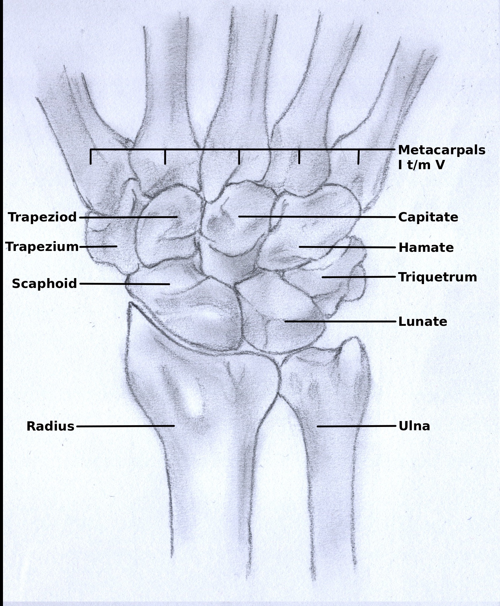

# Wrist Anatomy in the Growing Skeleton

*Referenced from the main [README](../README.md).*

Reading a pediatric wrist radiograph well requires more than knowing adult anatomy scaled down. Growing bone behaves differently, both biomechanically and radiographically, and that difference is exactly what makes pediatric fracture detection its own problem rather than a smaller version of the adult one.

## Why Pediatric Bone Is Different

Pediatric bone has a lower modulus of elasticity and a thick, highly vascular periosteum, properties that produce fracture patterns markedly different from adult presentations [4], [5]. An adult bone under stress tends to break cleanly. A child's bone, being more pliable, is more likely to bend, buckle, or fracture incompletely, patterns that don't really exist in adult radiology at all.

## The Wrist and Distal Forearm

The pediatric wrist complex consists of the distal radius, the distal ulna, and the proximal carpal row.

*Illustration by Cvpoucke, CC BY-SA 3.0, via Wikimedia Commons.*

- The **distal radius** is the principal weight-bearing bone of the forearm at the wrist joint [1], [2], which is exactly why distal radius fractures are the single most common pediatric trauma presentation seen in clinical practice [2], [4], [5].
- The **distal ulna** articulates with the radius and the wrist's soft tissue structures. Isolated ulnar shaft fractures are comparatively rare and usually involve direct trauma or accompanying radial displacement [3], [4].
- **Combined radius and ulna fractures** are common, since energy transfers across the interosseous membrane during a typical fall onto an outstretched hand [4], [5].
- **Carpal bones** ossify in a predictable postnatal sequence, and unossified cartilage stays radiolucent until it does. In younger children, this means structural evaluation often leans more on clinical alignment guidelines than on the appearance of bones that haven't fully ossified yet [1], [5].

## The Growth Plate: A Blind Spot for the Model

The physis (growth plate) is a cartilaginous zone between the metaphysis and epiphysis responsible for longitudinal bone growth [4]. Because uncalcified cartilage attenuates comparatively few X-ray photons, a normal physis appears as a smooth radiolucent band [1], visually similar to what a fracture line looks like.

This is a genuine diagnostic challenge, for a trained radiologist and for a detection model alike: preventing confusion between normal developmental anatomy and acute pathology is a real skill, not an afterthought [1], [4]. Traumatic disruption across the Salter-Harris spectrum can present subtly, as physeal widening, asymmetric lucency, or a metaphyseal fracture extension like the Thurston-Holland fragment seen in Type II injuries [2], [4]. Without that anatomical context, an object detector trained purely on visual pattern can easily misidentify a normal physis as a fracture line [1].

## Carpal Ossification and Normal Variants

The carpal bones don't appear on X-ray all at once. Each one ossifies on its own schedule, starting with the capitate at around age 1 and finishing with the pisiform around age 9 to 10, with all of them typically fusing by age 14 to 16 [1]. A wrist X-ray of a 3-year-old and a wrist X-ray of a 12-year-old can look substantially different even with no injury at all, simply because different carpal bones haven't ossified yet at younger ages.

This matters directly for the `boneanomaly` class discussed earlier. A carpal bone that hasn't ossified yet, or an accessory ossification center that's a completely normal variant, can look unfamiliar or even "abnormal" to a model (or a reader) that isn't accounting for the patient's age. Reliable interpretation of a pediatric wrist X-ray, by a person or a model, has to be age-aware. A finding that would be alarming on an adult wrist can be completely unremarkable on a 5-year-old's.

## Fracture Patterns in Growing Bone

Because immature bone tends to buckle or bend under load rather than fail cleanly, a few characteristic patterns dominate in this population [4], [5]:

- **Buckle (torus) fractures** — the metaphyseal cortex fails under axial compression, producing a subtle cortical bulge or wrinkle without a distinct radiolucent line [2], [4], [5]. This is the pattern most likely to be visually subtle enough to challenge a detector.
- **Greenstick fractures** — tensile force breaks one cortex while the opposite, compressed cortex stays intact, producing angular deformity [4], [5].
- **Complete fractures** — a full cortical break across both surfaces, often with translation or angulation requiring closed reduction [4], [5].

## Secondary Signs: Reading Between the Lines

When the primary cortical disruption is non-displaced or equivocal, secondary radiographic signs carry real diagnostic weight [1]:

- **The pronator quadratus fat plane**, evaluated on the lateral view, normally appears as a thin radiolucent stripe parallel to the anterior distal radius [1]. Ventral displacement, bowing, or obliteration of this stripe suggests occult volar cortical trauma or a deep tissue hematoma, even when no fracture line is directly visible [1].
- **Soft tissue swelling** is an expansion of the tissue envelope near the trauma site. It's nonspecific on its own, but it remains a useful indirect indicator during radiograph triage [1], [4].

## References

[1] Orthobullets. *Wrist Trauma Radiographic Evaluation, Hand.*

[2] Orthobullets. *Distal Radius Fractures, Trauma.*

[3] Orthobullets. *Isolated Ulnar Shaft Fracture, Trauma.*

[4] Orthobullets. *Both Bone Forearm Fracture, Pediatric, Pediatrics.*

[5] BOAST / ScienceDirect. *Paediatric forearm fractures, evidence update and BOAST guidelines.*
