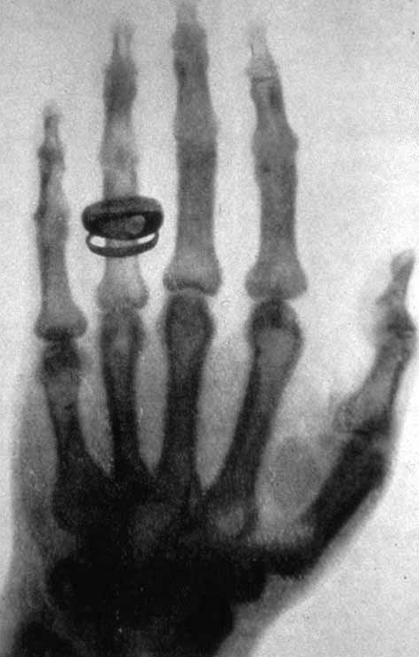
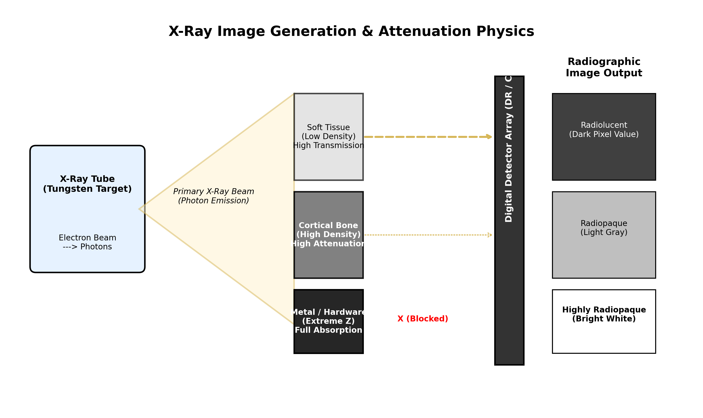
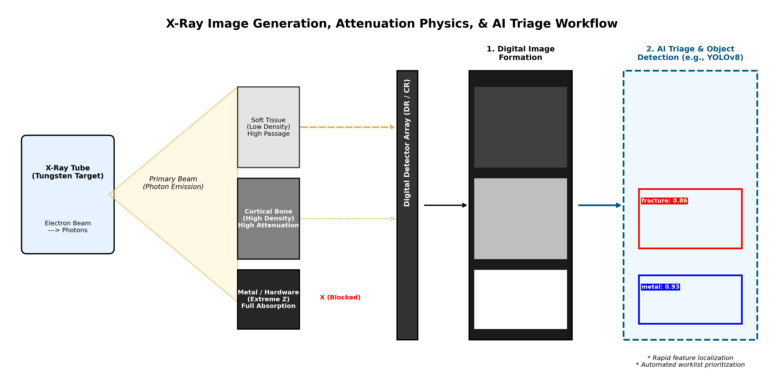

# X-Ray Physics: From Photons to Pixels

*Referenced from the main [README](../README.md).*

Understanding how an X-ray image actually forms matters here for a specific reason: the feature maps a neural network learns from a radiograph correspond directly to physical tissue density and detector behavior, not abstract visual patterns. Knowing the physics is what lets you reason about *why* a model finds one class easy and another hard.

## A Brief History

Conventional radiographic examination has been fundamental to diagnostic imaging since Wilhelm Roentgen produced the first X-ray image in 1895 [1]. Over a century later, the underlying physics hasn't changed, even though the way that physics gets converted into a viewable image has evolved considerably, from chemical film to fully digital detectors.

*This image (not Röntgen's actual first X-ray, which was of his wife Anna's hand in December 1895) was taken about a month later, during a public lecture demonstrating the discovery. It's one of the earliest surviving X-rays and shows the same core physics discussed below still holds. Image: Wilhelm Röntgen; current version created by Old Moonraker. Public domain, via Wikimedia Commons.*

## How X-Rays Form an Image

X-rays are a form of radiant energy similar to visible light, but with a much shorter wavelength, which is what lets them penetrate substances that are opaque to ordinary light [1]. The beam itself is produced by bombarding a tungsten target with an electron beam inside an X-ray tube [1].

As the beam passes through the body, it's attenuated (absorbed and scattered) by different tissues, producing a pattern on the detector that we recognize as anatomy [1]:

- **Radiolucent structures** (like soft tissue or air) absorb few photons due to their low density. More radiation passes through to the detector, producing dark gray to black pixel values [1].
- **Radiopaque structures** (like cortical bone, and especially metal) absorb a high proportion of incident photons. Less radiation reaches the detector, producing light gray to stark white regions [1].

That single contrast, radiolucent versus radiopaque, is the entire basis for everything a radiograph shows.

## From Beam to Digital File

How that attenuated beam gets converted into a viewable image directly affects contrast, dynamic range, and edge sharpness in any dataset built from it [1], [2]. Three approaches exist:

| System | How it captures the image | Key tradeoff |
|---|---|---|
| **Film radiography** | X-rays strike a fluorescent screen inside a film cassette, which emits light that exposes photographic film, chemically developed afterward [1]. | Requires physical processing; largely legacy at this point. |
| **Computed radiography (CR)** | A phosphor imaging plate replaces the film cassette. A laser scanner reads the latent image off the plate and converts it to digital form before erasing the plate for reuse [2]. | No chemical processing, but still a two-step capture-then-scan process; remains useful for portable bedside imaging [2], [3]. |
| **Digital radiography (DR)** | A fixed electronic detector or CCD captures the image directly in digital form, with no intermediate plate [2], [3]. | Immediate digital output, ideal for fluoroscopy and image subtraction, but usually installed in a fixed gantry rather than portable [2], [3]. |

## Why This Matters for Object Detection

In a framework like YOLOv8, class boundaries essentially trace attenuation interfaces created by tissue density differences [1]. That connection is worth having in mind for every class this project detects:

- **Fracture** — a disruption of cortical or trabecular bone, replaced by lower-density soft tissue or hematoma, appears as a radiolucent line, lucent band, or cortical step-off interrupting normally radiopaque bone [1].
- **Metal and laterality markers** — high atomic number materials completely attenuate the beam, producing stark white regions with sharp, high-contrast edges, which is exactly why the model learns these so easily [1].
- **Periosteal reaction** — reactive new bone formation shows up as a fine, linear radiopaque line running parallel to the bone shaft [1].
- **Soft tissue swelling and fat pad signs** — edema displaces or obliterates fat planes, which are naturally more radiolucent than surrounding muscle, producing a blurred or displaced dark stripe rather than a clean one [1].

Every class in this project's glossary, in other words, is really just a name for a specific attenuation pattern.

## References

[1] Helms, C. A. *Conventional Radiography: Image Generation and Film Radiography.*

[2] Helms, C. A. *Computed Radiography (CR).*

[3] Helms, C. A. *Digital Radiography (DR).*
